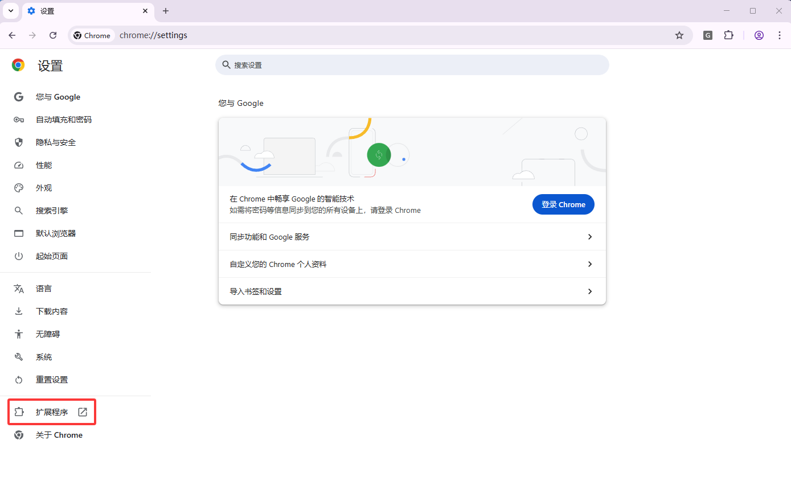
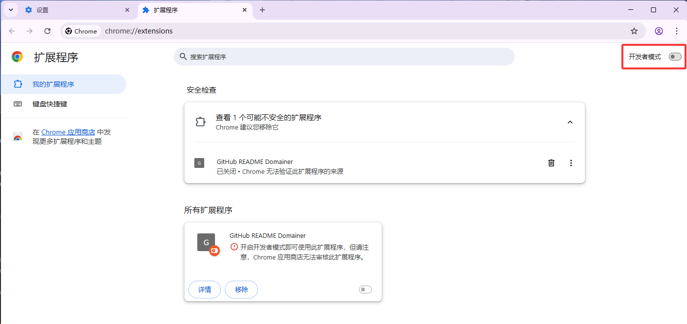

# 插件安装和配置指南

## 项目结构

本项目包含两个文件夹：
- `chrome` - 包含后端代码
- `chajian` - 包含前端代码

## 后端配置

### 环境要求
- Python 3.12

### 依赖库
```
flask 3.0.3
flask-cors 6.0.1
openai 1.97.1
joblib 1.4.2
numpy 1.26.4
scipy 1.13.1
```

### 启动后端服务

1. 运行 `domain_get.py` 文件
2. 控制台将显示以下信息：
   ```
   * Running on all addresses (0.0.0.0)
   * Running on http://127.0.0.1:8000
   * Running on http://192.168.1.36:8000
   Press CTRL+C to quit
   ```
3. **记录第二行的地址**（例如：`http://127.0.0.1:8000`）

## 前端配置

1. 打开前端代码中的 `popup.js` 文件
2. 找到第57行附近的代码：
   ```javascript
   // 利用flask后端完成逻辑
   try {
     const resp = await fetch('http://127.0.0.1:8000/domain', {
       method: 'POST',
       headers: { 'Content-Type': 'application/json' },
       body: JSON.stringify({ text, api_key })
     });
   ```
3. 将地址修改为后端启动时显示的第二行地址

## 浏览器插件安装

1. 打开 Google Chrome 浏览器
2. 进入**设置** > **扩展程序**
   
   
   
3. 打开**开发者模式**
   
   
   
4. 点击**加载未打包的扩展程序**
   
   
   
5. 选择下载的 `chajian` 文件夹即可导入并使用该插件

## 使用说明

完成以上配置后，插件即可正常使用。
